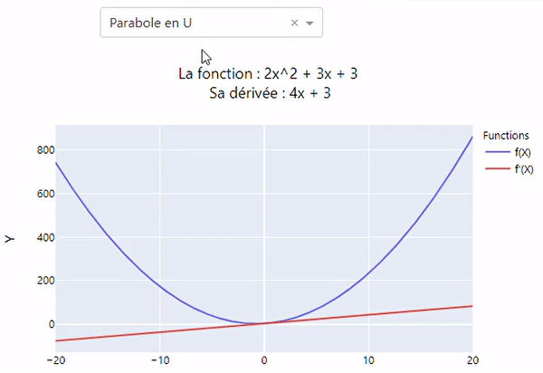

# Maths78

Maths78 is a little application that provides maths teachers simple exercises and high school students to understand some basics and fundamentals mathematics concepts.

The app : [Maths78](https://maths78.herokuapp.com/)

## Requirements

Use [pip](https://pypi.org/project/pip/) to install all requirements : `pip install -r requirements.txt`

### Documentation

## Built With

- [plotly](https://plotly.com/python/) - Interactive graphics
- [dash](https://plotly.com/dash/) - For the application
- [heroku](https://dashboard.heroku.com/) - Cloud Application Plateform

## Authors and acknoledgment

Developped by Issam Merikhi with the support Tiphaine Richard as a personal project.

## License

This project is released under the [Apache 2.0 License](https://github.com/IssamMerikhi/Maths78/edit/main/LICENSE)
