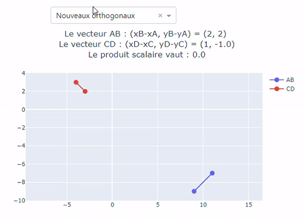

# Maths78

Maths78 is a little application that provides maths teachers simple exercises and high school students to understand some basics and fundamentals mathematics concepts.

The app : [Maths78](https://maths78.herokuapp.com/)

## Requirements

Use [pip](https://pypi.org/project/pip/) to install all requirements : `pip install -r requirements.txt`

# Documentation

Maths78 is a simple App that provides an **infinite of exercises** helping maths teachers in lack of exercises and also high school students. the App covers 4 fundamentals mathematical concepts which are :

- 2nd and 3rd functions degree and theirs derivatives.
- Arithmetics and geometrics sequences.
- Vectors and orthogonality
- Log

Exercises are computed with random coefficients which provides the user an infinite of exercises. No need to prepare classes ANYMORE.

## Usage

The App has been made the simplest possible. The 4 topics are displayed in 4 differents and distincts blocks. Once the topic choosed, the user can click on the dropdown which provides differents subtopics on a concept.

As example, the user can choose the functions topic and choose a 2nd degree function with n-shape or U-shape. Be careful, since the coefficients are ceated randomly the user can fall with a 2nd degree function with a=0 which will be just a line.

Again the user is in the Vctor topic' right here points are created randomly. Here the dropdown offers 2 choices, randoms vectors or orthogonals vectors. The teachers can give the 4 points and let the students plot the vectors and calculate if they are orthogonal or not.

## Built With

- [plotly](https://plotly.com/python/) - Interactive graphics
- [dash](https://plotly.com/dash/) - For the application
- [heroku](https://dashboard.heroku.com/) - Cloud Application Plateform

## Contributing

We appreciate all contributions to improve Maths78. For major changes, please open an issue first to discuss what you would like to change.

## Authors and acknoledgment

Developped by Issam Merikhi with the support Tiphaine Richard as a entertaining project.

## License

This project is released under the [Apache 2.0 License](https://github.com/IssamMerikhi/Maths78/edit/main/LICENSE)
